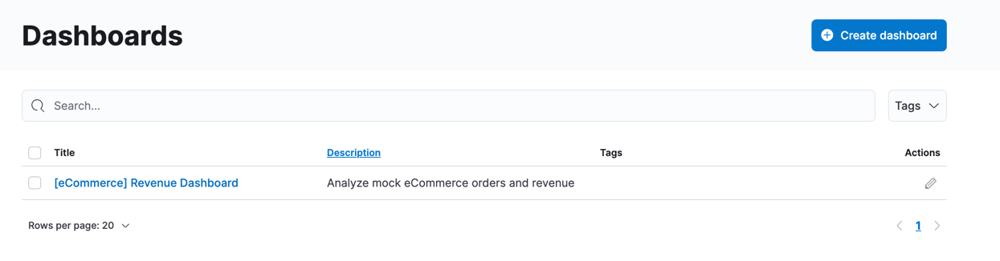
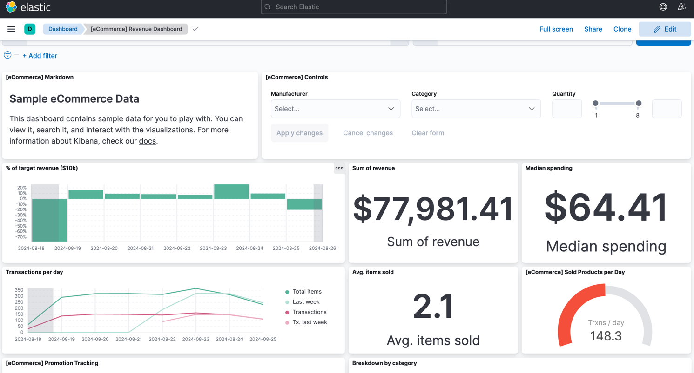
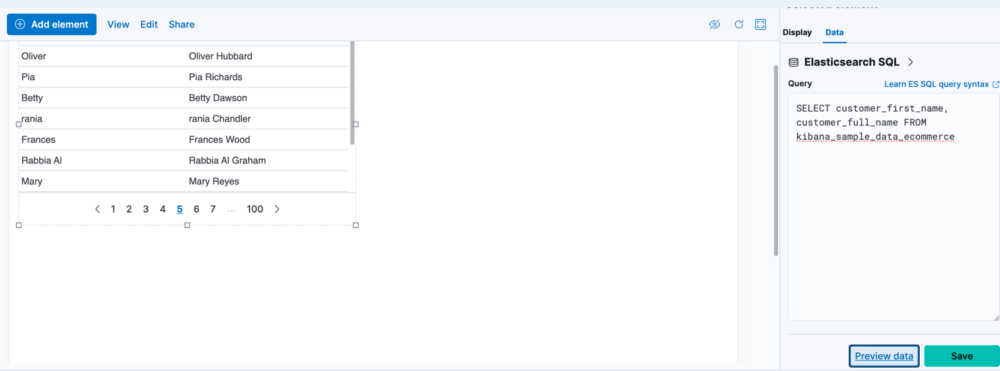
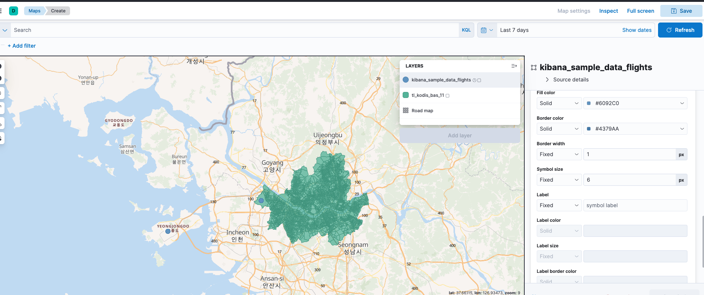

## 키바나 
* 키바나는 엘라스틱 스택의 관리, 모니터링 등 솔루션을 총괄하는 메인 UI이다. 
* 키바나 대표 기능 
  * 데이터 분석 및 시각화 툴 
  * 엘라스틱 관리 
  * 엘라스틱 중황화 툴 
* 키바나의 시각화 기술 
  * 디스커버 : 데이터를 도큐먼트 단위로 분석하 구조 관계 등을 확인한다. 
  * 시각화 : 다양한 그래프 타입으로 데이터를 시각화한다. 
  * 대시보드 : 그래프와 지도를 한 곳에 볼 수 있도록 한다. 
  * 컨버스 : 그래프와 지도를 프레젠테이션처럼 구성할 수 있다.
  * 맵스 : 위치 기반 데이터를 지도 위에서 제공한다. 
* 인덱스 패턴 
  * 키바나에서 ES 인덱스의 필드 포맷 등을 캐싱해 둔 메타데이터로 ES 인덱스와 연결되어 있다. 
  * 키바나에서는 ES 인덱스에 직접 접근하지 않고, 인덱스 패턴에 접근해 쿼리를 하고 시각화 한다.
  * 인덱스 패턴의 패턴명은 와일드카드(`*`)와 쉼표(`,`)를 사용해 복수 패턴을 포함할 수 있고, 마이너스(`-`) 기호를 사용하여 특정 패턴을 제외할 수 있다.


### 디스커버 
#### 구성 
* 쿼리바 
  * 쿼리를 사용하여 데이터를 검색할 수 있다.
  * KQL과 루씬 쿼리 스트링 두 가지 언어를 지원하고, 특별한 설정이 없으면 KQL을 이용한다.
* 필터바 
  * 쿼리를 필터처럼 사용할 수 있다.
  * 개별적으로 필드를 제어할 수 있다. 
* 타임피커 
  * 날짜/시간 정보를 조작하여 데이터의 특정 날짜/시간 범위 내 데이터를 시각화 한다. 

### 대시보드 
* 시각화 타입들을 한 페이지에 볼 수 있는 기능을 제공한다.
* 대시보드를 만들기 위해 크게 익힐 것은 없고, Dashboard메뉴에서 Create dashboard 버튼을 눌러 대시보드를 생성할 수 있다.


샘플 데이터 대시보드 예시 
 

### 캔버스 
* 인포그래픽 형태로 데이터를 프레젠테이션 할 수 있게 도와주는 툴이다.
* Canvas 메뉴에서 Create workpad버튼으로 캔버스를 만들 수 있다.
* 데이터는 엘라스틱서치 SQL, 도큐먼트 등의 방식으로 가져올 수 있다.

#### 엘라스틱 SQL 
* 엘라스틱서치에서는 SQL문을 지원하기 위해 `_sql`이라는 API를 제공한다.
```
POST _sql?format=txt
{
  "query": """
  SELECT customer_first_name,  customer_full_name FROM kibana_sample_data_ecommerce
  """
}

```


### MAPS 
* 위치 정보가 포함된 데이터를 지도에서 시각화 할 수 있는 기능이다. 
* Kibana 8 버전에서는 map.regionmap 설정이 더 이상 지원되지 않는다고 하여, GeoJSON을 kibana ui에서 업로드 하는 방식을 사용했습니다. 
  * https://discuss.elastic.co/t/kibana-yml-map-regionmap/300935
  * GeoJSON 파일을 upload하면 Index pattern으로 저장된다. 

  * 위처럼 여러 Layer을 추가하여 지도 위에서 데이터를 확인할 수 있다. 

